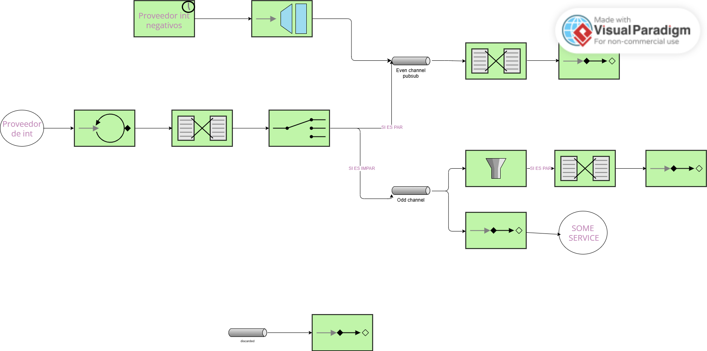

# Lab 5 Integration and SOA - Project Report

## 1. EIP Diagram (Before)

The initial code partially implemented the target diagram, but it contained several errors that caused incorrect behavior.  
In the starter code, the flow was:

- The producer generated numbers and sent them directly to the router without an intermediate channel.
- Odd numbers were sent to `oddChannel`, but this channel was not publish-subscribe, so only one of the consumers (the filter in `oddFlow` or the `@ServiceActivator`) received the message, but never both.
- The filter in `oddFlow` was incorrectly implemented: it only allowed even numbers, so it rejected all odd numbers.
- The gateway sent negative numbers to the `evenChannel`, which caused odd negative numbers to end up in the wrong flow.
- The overall flow did not match the target diagram or the expected routes.

---

## 2. What Was Wrong

**Bug 1**: **Incorrect filter in oddFlow**

In the initial code:  

    filter { p: Int -> p % 2 == 0 }

This meant that the `oddFlow` accepted only even numbers, when it should have accepted all odd numbers.

*Why it happened*: It was a logical error: the opposite condition was used instead of the correct one.

*Solution*: Remove the filter completely, since it was not needed in the final version of the diagram.

**Bug 2**: **`oddChannel` was a DirectChannel instead of a Publish-Subscribe**

The starter code did not define `oddChannel`, so Spring Integration created it as a `DirectChannel` by default.

This caused:

- Odd messages were sent to only one consumer, not both.
- Sometimes the filter received the message and rejected it.
- Other times the `ServiceActivator` received it.

*Solution*: Convert `oddChannel` into a pub-sub channel. Do not use a filter in the flow and allow the `ServiceActivator` to always receive the message.  Also, separate the flows correctly and avoid relying on implicit channels.

**Bug 3**: **The Gateway sent negative numbers to `evenChannel`**

In the initial code:

    @Gateway(requestChannel = "evenChannel")
    fun sendNumber(number: Int)

This caused any number sent by the gateway (including negatives) to be processed as if they were even.

*Why it happened*: The gateway configuration completely ignored the router.

*Solution*: Change the gateway channel: 

    @Gateway(requestChannel = "numberChannel") 

Now all numbers (external and produced) go through the same routing logic.

**Bug 4**: **The router and the producer were mixed in the same flow**

In the starter code, the `route` was inside the same flow as the producer.  
This made it difficult to insert the gateway and created unnecessary coupling.

*Solution*: Split the flow:

- `producerFlow` → generates and sends to `numberChannel`  
- `numberFlow` → receives and routes according to even/odd  

This matches the standard EIP diagram.

**Bug 5**: **Inconsistent behavior between the consumers of `oddChannel`**

Since the channel was a `DirectChannel` and had two consumers:

- the filter in `oddFlow`  
- the `@ServiceActivator`  

…only one of them received the message.

*Solution*: Remove the filter and keep a single flow for odd numbers, plus the `ServiceActivator`.

---

## 3. What You Learned

During the practice I learned:

### Enterprise Integration Patterns
- Understanding the difference between **Content-Based Router**, **Filter**, **Transformer**, and **Service Activator**.  
- Seeing how the incorrect configuration of a single pattern can completely break the flow.  
- Realizing that channels are as important as endpoints: *publish-subscribe* vs *direct* totally changes the behavior.  

### Spring Integration
- How EIPs are implemented using DSL in Kotlin.  
- How to build decoupled flows using `integrationFlow`.  
- What it means to let Spring create channels by default (`DirectChannel`).  
- How Gateways work to inject external messages.  
- How the poller turns a method into a periodic message producer.  

### Challenges and Solutions
- The biggest challenge was identifying why some odd numbers were processed and others not: the root cause was the implicit channel.  
- Another challenge was following the traces produced by the logger to rebuild the exact flow.  
- Splitting complex flows into smaller parts was key to understanding and fixing them.  

---

## 4. AI Disclosure

**Did you use AI tools?** (ChatGPT, Copilot, Claude, etc.)  
Yes  

**Which tools?**  
ChatGPT  

**What did they help with?**  
ChatGPT only helped me fix compilation errors, such as syntax issues, imports, or incorrect declarations inside Spring Integration flows. It did not design the flow or routing logic; it was used only as a technical assistant to solve specific errors that prevented compilation.  

**What did you do yourself?**  
- Analyzed the original code and detected the logical routing problems.  
- Rebuilt and adjusted the flows according to the studied EIP patterns (router, service activator, transformer).  
- Organized the final flow into several separate `integrationFlow`s.  
- Tested each part of the system to validate that numbers were routed correctly.  
- Wrote all the logic for handling even, odd, and negative numbers myself.  

**My understanding**  
I understand how the main Enterprise Integration Patterns work in practice:  
- **Content-Based Router**: redirects messages based on their content, such as separating even and odd numbers.  
- **Service Activator**: connects business logic with the flow, allowing messages to be processed in normal methods.  
- **Transformer**: converts or adapts the message before sending it to the next step.  
- **Message Channels**: the importance of distinguishing between `DirectChannel` and `PublishSubscribeChannel`, and how this affects the number of consumers that receive a message.  

I also understand how Spring Integration implements these patterns through DSL and how each part of the flow influences the overall system behavior.  

---

## Additional Notes

The practice was very useful to understand why in small integration systems errors may go unnoticed, but in complex architectures they can cause message loss or inconsistent results.  

Explicitly separating flows and channels greatly helps with maintenance, debugging, and readability.  

The use of detailed logs, as provided in the starter code, is essential to understand the real sequence of processing.